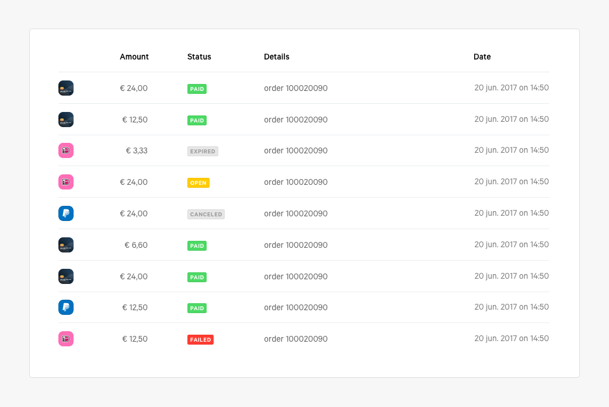
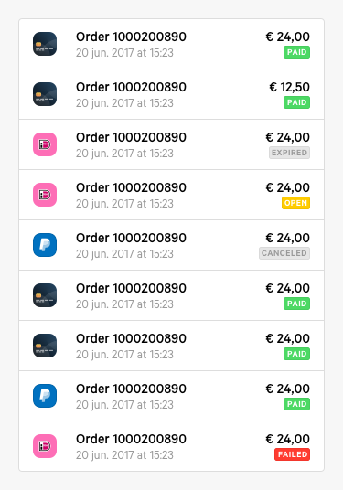

# Hi there 👋

Thanks for taking the time to interview at Mollie. This assigment will be used by us to assess your technical skills. It will also give us something to talk about should you progress to the technical interview.

It should take you about 4 hours to complete all exercises. If you’re stuck on a problem, try to work around it or come back to it later. When reviewing, **we will focus on intent more than on implementation details**.

We advice you to read through all the exercises before starting. This will help you make informed technical decisions as you go through them.

## Getting started

Install dependencies by running

```bash
yarn install
```

Start the server by running

```bash
yarn start
```

You can run tests by running

```bash
# Optionally add --watchAll to run tests in watch mode
yarn test
```

## Good to know

* This assignment was built on top of [Create React App](https://create-react-app.dev/), see [their documentation](https://create-react-app.dev/docs/getting-started) should you run into any technical issues.
* Routing is handled by [React Router](https://reacttraining.com/react-router/web/guides/quick-start).
* Both [CSS Modules](https://github.com/css-modules/css-modules) and [Sass](https://sass-lang.com/) are supported in the project, but feel free to use vanilla CSS if you prefer.
* You can ignore older browsers.

## Exercise #1

Make sure payments are fetched from the API (`http://localhost:4000/api/payments`) on the [payments page](http://localhost:3000/payments). You will find the code in `src/pages/Payments/Overview/index.js`. This exercise does not prescribe a way of storing data, you can store the payments on the client however you feel is best.

## Exercise #2

In the root of this project you will find `PaymentsTableDesktop.png` and `PaymentsTableMobile.png`. Your task is to implement these designs and render the payments you fetched in the previous exercise to the screen.




## Exercise #3

Implement the payment detail page on the route `/payments/:id`. The view already exists, but you will need to fetch some additional data, namely the refunds a payment might have. You can do this by querying the `http://localhost/api/payments/:id/refunds`. The refunds table should have the same kind of structure as the payments table, but don’t spend too much time on it.

## Exercise #4

If a resource—for example a payment or customer—is fetched on one page, you should be able to re-use it on other pages without re-fetching it. If the data is older than 2 minutes, fetch a new copy instead.

## Requirements
* The design should be responsive.
* The design needs to resemble the PNG, but pixel perfection is not expected.
* Each row should link to a detail page, the route for which is `/payments/:id`.
* Handle state changes and exceptions.
* We like tests.
* We like documentation and clarification.

